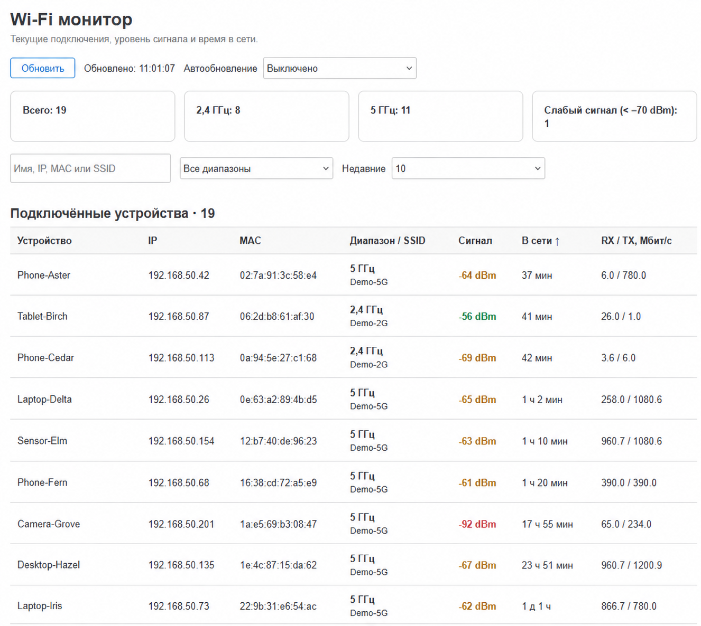
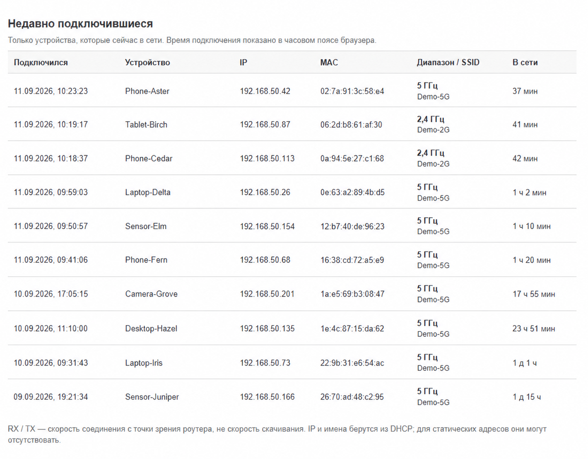

# OpenWrt Wi-Fi Monitor

[English](README.md) | **Русский**

**Кто подключён к Wi-Fi прямо сейчас, как давно и с каким сигналом — на одной странице LuCI.**

Wi-Fi Monitor добавляет пункт **Сервисы → Wi-Fi Monitor**. Он собирает текущие подключения с беспроводных интерфейсов, дополняет их именами и IP из DHCP и показывает две таблицы: все подключённые устройства и недавно подключившиеся. Содержимое страницы автоматически отображается на русском или английском языке в соответствии с языком LuCI.

[Установка](#установка) · [Возможности](#возможности) · [Сравнение с DHCP-арендами](#почему-не-достаточно-списка-dhcp-аренд) · [Ограничения](#что-важно-знать)



*На иллюстрациях имена устройств, SSID, IP и MAC заменены вымышленными данными. Показан фрагмент общего списка; счётчик относится ко всем подключениям.*

## Почему не достаточно списка DHCP-аренд

DHCP-аренда отвечает на вопрос **«какой адрес выдан устройству и сколько ещё действует аренда?»**. Она не подтверждает, что устройство прямо сейчас подключено к Wi-Fi. Телефон мог уйти из сети, а запись об аренде ещё остаётся. Кроме того, в арендах могут быть и проводные клиенты.

Wi-Fi Monitor отвечает на другой вопрос: **«какие устройства видит Wi-Fi-драйвер сейчас и как выглядит их подключение?»**. Основа списка — `iw ... station dump`; DHCP используется только для сопоставления MAC с IPv4-адресом и именем.

| Что нужно узнать | Список DHCP-аренд | Wi-Fi Monitor |
| --- | --- | --- |
| Выданный IP и имя | Да | Да, если есть локальная DHCP-аренда |
| Остаток срока аренды | Да | Не отображается |
| Текущее Wi-Fi-подключение | Наличие аренды этого не гарантирует | Список станций от Wi-Fi-драйвера |
| Как давно клиент подключился к Wi-Fi | Срок аренды не равен времени подключения | Длительность текущего подключения |
| Кто подключился последним | По арендам нельзя надёжно определить | Отдельная таблица по времени подключения |
| Диапазон, SSID и сигнал | В самой таблице аренд этих данных нет | В строке устройства |
| Скорости соединения RX / TX | В самой таблице аренд этих данных нет | Если их предоставляет драйвер |
| Клиент с вручную заданным IP | Может отсутствовать | Видно подключение и MAC; IP может быть неизвестен |

### А чем удобнее штатного статуса Wi-Fi?

В LuCI уже есть **Associated Stations / Подключённые станции**: там доступны подключённые клиенты, сигнал и скорости RX/TX. Wi-Fi Monitor дополняет этот обзор удобствами для повседневного наблюдения:

- **Время в сети и недавние подключения.** Сразу видно, какое устройство только что подключилось или переподключилось.
- **Поиск и сортировка.** Можно найти клиента по имени, IP, MAC или SSID, затем отсортировать список по сигналу или времени в сети.
- **Фильтр диапазона.** Удобно отдельно посмотреть клиентов 2,4 или 5 ГГц.
- **Сводка над таблицей.** Общее число подключений, количество по диапазонам и число клиентов со слабым сигналом.
- **Управляемое обновление.** Один снимок по кнопке либо обновление каждые 10, 30 или 60 секунд.

Например, после подключения нового телефона достаточно открыть «Недавно подключившиеся». Если камера работает нестабильно, её можно найти по имени и посмотреть сигнал и длительность текущего подключения. Сам монитор не устанавливает причину разрывов, но помогает заметить признаки, которые стоит проверить.

## Возможности

- Отдельная страница LuCI на русском языке, доступная после обычного входа.
- Имя устройства, IPv4, MAC, диапазон, SSID, сигнал в dBm, время в сети, скорости RX/TX.
- Сортировка нажатием на заголовок столбца; повторное нажатие меняет направление.
- Поиск по имени, IP, MAC, SSID и имени интерфейса.
- Фильтры применяются к обеим таблицам; верхние счётчики показывают весь снимок.
- Последние 10, 20 или все текущие подключения, от новых к старым.
- Ручное обновление и отключаемое автообновление. По умолчанию оно выключено; скрытая вкладка не опрашивает роутер.
- При ошибке остаётся предыдущий снимок с сообщением об ошибке и временем последнего успешного обновления.
- Получение данных по запросу: отдельный постоянно работающий процесс сбора и запись истории на флеш-память не нужны.

## Недавно подключившиеся



Это **не журнал всех событий**. Здесь находятся только станции, которые остаются подключёнными на момент обновления. После отключения устройство исчезнет из обеих таблиц. Время подключения рассчитывается по часам роутера и длительности соединения, а показывается в часовом поясе браузера.

## Совместимость

Работа проверена на **OpenWrt 24.10.1 с LuCI и драйвером mac80211 на MediaTek Filogic**. На других версиях и драйверах требуется проверка; некоторые поля могут отсутствовать.

Нужны LuCI, `rpcd`, `ubus`, команда `iw` и библиотека `/usr/share/libubox/jshn.sh` из пакета `jshn`. В стандартной установке LuCI большая часть зависимостей уже присутствует. Установщик проверяет необходимые команды и файлы до копирования.

Рекомендуемый сценарий — роутер или точка доступа, где `iw` показывает подключённых Wi-Fi-клиентов. Имена и IPv4 читаются из `/tmp/dhcp.leases`. Если DHCP работает на другом устройстве, подключения будут видны, но имена и IP могут отсутствовать.

## Установка

Войдите на роутер по SSH с правами root. Скачайте и распакуйте исходники:

```sh
mkdir -p /tmp/wifi-monitor-install
cd /tmp/wifi-monitor-install
wget -O source.tar.gz https://github.com/numbereleven-a/OpenWrt-WiFi-Monitor/archive/refs/heads/main.tar.gz
tar -xzf source.tar.gz
cd OpenWrt-WiFi-Monitor-main
sh install.sh
```

Откройте **Сервисы → Wi-Fi монитор**. Прямой путь относительно адреса вашего роутера: `/cgi-bin/luci/admin/services/wifi-monitor`.

Если пункт меню не появился, выйдите из LuCI и войдите снова. Если браузер показывает старую версию страницы, выполните принудительное обновление страницы.

Установщик копирует четыре файла и перезапускает `rpcd`, чтобы зарегистрировать метод получения данных. Текущая сессия LuCI может потребовать повторного входа. **Перезагрузка роутера и перезапуск Wi-Fi не требуются.** Настройки беспроводной сети и DHCP не меняются. Существующий консольный скрипт `wifi_monitor`, если он есть, остаётся на месте; веб-интерфейс от него не зависит.

| Файл | Назначение |
| --- | --- |
| `/usr/libexec/rpcd/wifi-monitor` | Сбор данных и RPC-метод `status` |
| `/www/luci-static/resources/view/wifi-monitor.js` | Страница LuCI |
| `/usr/share/luci/menu.d/luci-app-wifi-monitor.json` | Пункт меню |
| `/usr/share/rpcd/acl.d/luci-app-wifi-monitor.json` | Доступ к чтению данных через LuCI |

### Обновление и удаление

Для обновления скачайте свежую версию и снова выполните `sh install.sh`. Заменяемые файлы сохраняются в `/root/wifi-monitor-backups/` в отдельной папке для каждого запуска. При первой установке резервная папка может быть пустой.

Для удаления из каталога с исходниками:

```sh
sh uninstall.sh
```

Удаляются только четыре файла компонента и обновляется регистрация RPC. Резервные копии и исходный консольный скрипт сохраняются. После обновления прошивки ручную установку может потребоваться повторить: это файловая установка, а не пакет, зарегистрированный в `opkg`.

## Что важно знать

- **«В сети» — длительность текущего Wi-Fi-подключения**, а не срок DHCP-аренды и не время работы устройства. После переподключения отсчёт начинается заново.
- **RX/TX — скорости радиосоединения**, а не тест скорости интернета и не фактическая загрузка канала. RX — приём роутером от клиента, TX — передача от роутера клиенту.
- **Сигнал** берётся из `signal avg`, а при отсутствии среднего — из `signal`. Зелёный: от −60 dBm; жёлтый: от −70 до менее −60 dBm; красный: ниже −70 dBm. Это ориентиры для просмотра, а не универсальная оценка качества связи.
- **Имена и IP — подсказки из локальных DHCP-аренд.** Нет IPv6, разрешения имён через DNS и гарантированного определения статических адресов. Смена MAC клиентом может выглядеть как другое устройство.
- **Счётчик отражает записи подключений.** Один клиент с несколькими интерфейсами или подключениями может учитываться несколько раз.
- **Монитор видит интерфейсы этого роутера**, а не автоматически все точки доступа сети. Поддержка диапазона 6 ГГц предусмотрена в таблицах и фильтре, но на проверенной конфигурации не тестировалась; отдельной карточки 6 ГГц нет.
- **Данные обновляются последовательно по интерфейсам.** Во время подключения или отключения возможны кратковременные расхождения; следующий снимок покажет актуальное состояние.

## Проверка работы

На роутере:

```sh
ubus call wifi-monitor status
```

В ответе должны быть `timestamp`, массив `devices` и строка `warning`. Пустой массив допустим, если нет Wi-Fi-подключений. Непустая `warning` перечисляет интерфейсы, которые не удалось прочитать.

Для проверки исходников на компьютере с Node.js:

```sh
node --check files/wifi-monitor.js
node tests/view.cjs
```

Тесты используют только вымышленные данные и облегчённую модель DOM. Они проверяют отображение, поиск, фильтрацию, сортировку, обновление и обработку ошибок; полноценную проверку страницы в браузере они не заменяют.

Установку, обновление с резервной копией и удаление можно проверить на OpenWrt или Linux командой `sh tests/install.sh`. Проверка использует отдельное временное дерево через `DESTDIR`, не перезапускает службы и сохраняет тестовую папку для осмотра.

## Как это устроено

```text
Страница LuCI → ubus / rpcd → iw: текущие Wi-Fi-станции
                          → DHCP: имена и IPv4 по MAC
```

Один запрос собирает набор данных, из которого строятся обе таблицы и счётчики. Фильтры и сортировка выполняются в браузере и не вызывают дополнительных команд на роутере.

Справка OpenWrt: [получение списка подключённых клиентов](https://openwrt.org/faq/how_to_get_a_list_of_connected_clients), [настройки DHCP и DNS](https://openwrt.org/docs/guide-user/base-system/dhcp). Возможности штатной таблицы станций видны в [исходниках LuCI](https://github.com/openwrt/luci/blob/openwrt-24.10/modules/luci-mod-status/htdocs/luci-static/resources/view/status/include/60_wifi.js).

## Лицензия

Проект распространяется по [лицензии MIT](LICENSE).
